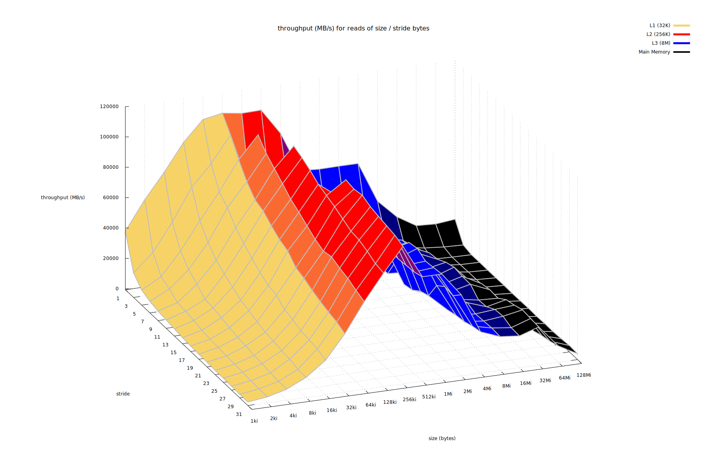

# Memory Mountain

An implementation of a memory mountain benchmark, as described by Computer Systems: A Programmer's Perspective.



## Building

```bash
make 
```

## Running

```bash
# see mountain --help for additional options
./mountain > run.txt
```


